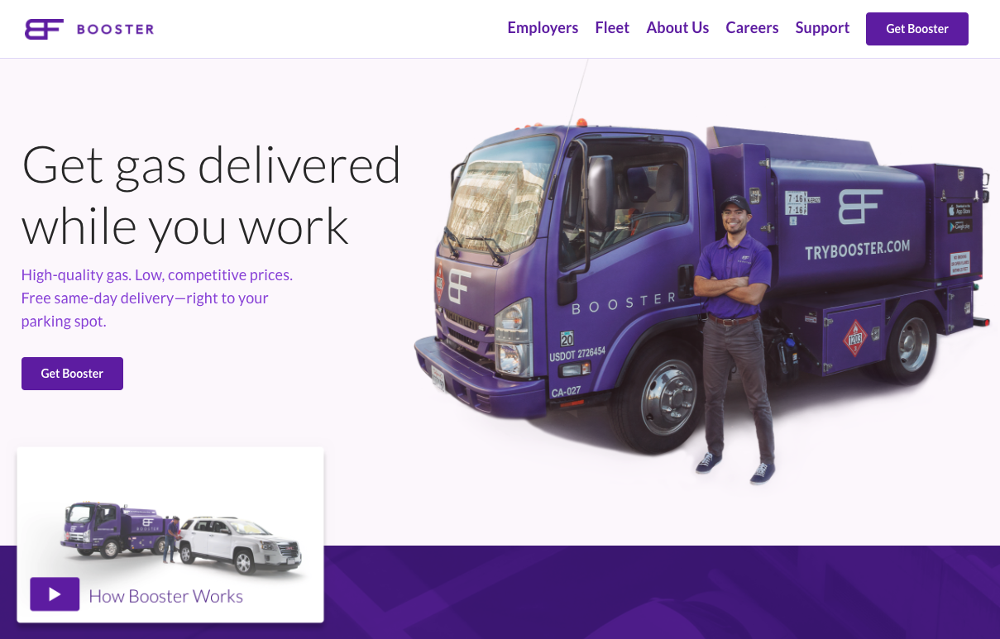
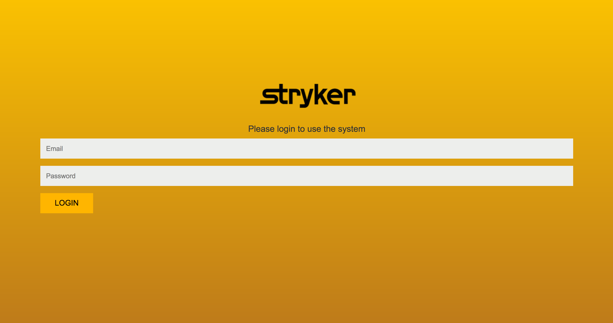
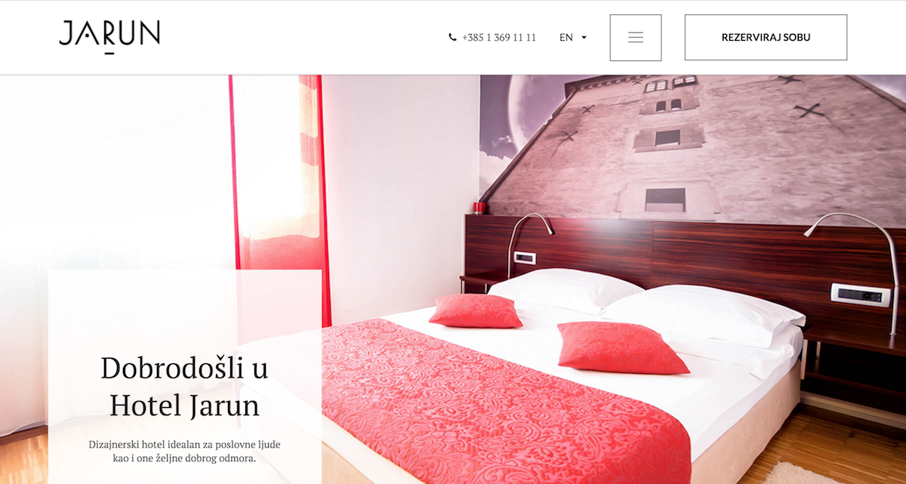
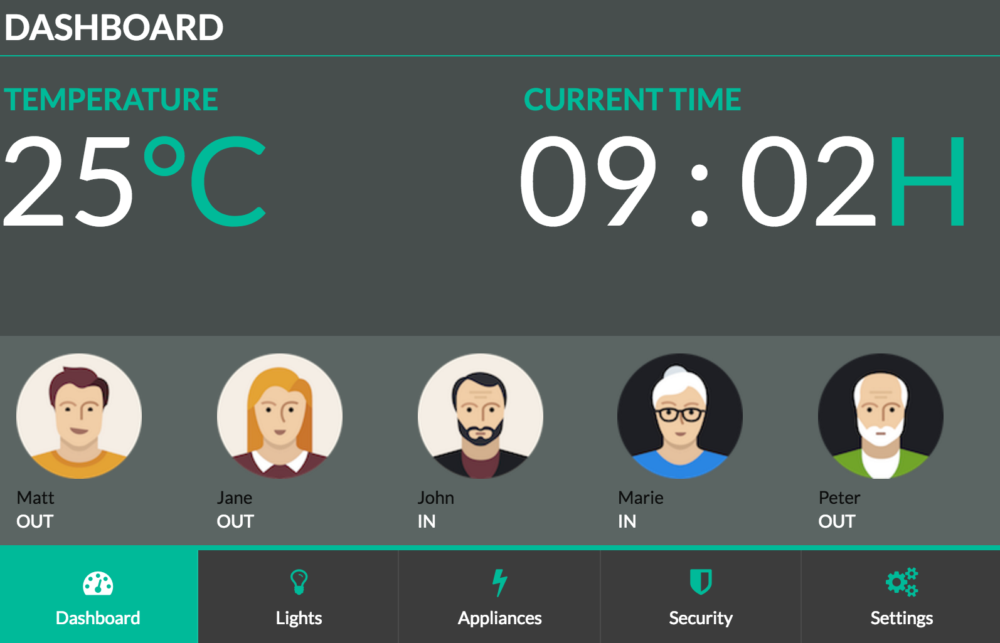
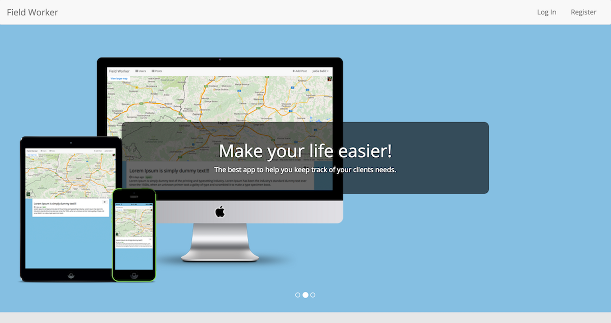

## About

Hi, I'm Javascript Developer.

## Social
- Homepage: [http://jaksabasic.com](http://jaksabasic.com)
- Twitter: [https://twitter.com/jaksabasic](https://twitter.com/jaksabasic)
- Github: [https://github.com/jaksa-b](https://github.com/jaksa-b)
- LinkedIn: [https://www.linkedin.com/in/jaksabasic](https://www.linkedin.com/in/jaksabasic)

## Education
[Vsite](http://vsite.hr/?q=en) (College for Information Technologies) - Master degree in Computer Science 

[Algebra](http://www.algebra.hr/) Web Development Course (Illustrator, Html5, Css3, Wordpress, Seo)

[Tvz](http://tvz.hr/en/) (Polytechnic university of zagreb) - Bachelor of Engineering in IT Technologies 

## Skills
`^` up and rising

###### Languages

- Html5, Css3, Sass, Bootstrap, Semantic UI
- Javascript `medium ^`

###### Web frameworks

- JQuary `medium`
- Angularjs ~1.xx, `medium` Angularjs 2.0 `medium ^`
- Node.js (express) `medium ^` 
- React.js `medium ^` (Redux, Mobx) `medium ^` 
- Meteor `medium ^`

###### Databases

- MySql `medium`
- MongoDB `medium ^`  - Finished: [M101JS: MongoDB for Node.js Developers](https://university.mongodb.com/course_completion/44941a645a4b47c9ac4705bd9713d203)
- Oracle Pl/Sql `medium`

###### Server architecture and application deployment
- GNU/Linux(Ubuntu, Debian) `medium ^`
- Nginx `medium ^`
- Docker `basics`

###### Cloud
- Amazon Web Services `basics`
- Heroku `medium`
- Digital Ocean `medium`

###### Real-time

- Firebase `medium`

###### Mobile
- Android `basics`
- IOS `basics`
- React Native (Ios/Android) `medium ^` 

## Tools

###### Revision control
- Git (gitHub, bitBucket, gitLab) `medium ^`

###### Project Management
- Trello
- Asana
- GitFlow
- Agile Scrum Methodologies
- Full Life-Cycle Software Development

###### Code Editor

- Visual Studio Code
- Android Studio
- Xcode

###### Build Tool
- Webpack

## Experience

#### Javascript Developer @[digihey](http://www.digihey.com/) 
August 2017 – (Present) Zagreb  
Building Web Applications with Angular, React, Redux

#### Javascript Developer @[Dream Implementation](https://www.dream-implementation.com/) 
September 2016 – August 2017 Zagreb  
Building Web Applications with Angular

#### Full Stack Javascript Developer (meteor) @[byLapis](https://bylapis.com)  
February 2016 – August 2016 Zagreb  
Building Web Applications with React and Meteor.js

#### Javascript Developer @Cinexio  
September 2015 – January 2016 Zagreb  
Developing Javascript parsers

#### Front-end, UI Developer @Ingel  
September 2012 – September 2015 Zadar  
Developing User interface, frontend development

## Work

### Booster Fuels Landing page @[Digihey](http://www.digihey.com/)

- Html5, Css3, Sass
- React, Redux, Next.js, SSR

### Styker Surgical Market Size Mapping tool @[Dream Implementation](https://www.dream-implementation.com/)

- Html5, Css3, Sass
- Bootstrap
- Angular 1.x

### [Sretno](https://www.sretno.eu/) @[Dream Implementation](https://www.dream-implementation.com/)

- Html5, Css3, Sass
- Canvas
- Bootstrap
- Angular 1.x

### PTV Reseller @[Dream Implementation](https://www.dream-implementation.com/)

- Html5, Css3, Sass
- Bootstrap
- Angular 1.x

### [Hotel Jarun Zagreb](https://www.hotel-jarun.com/) @[byLapis](https://www.bylapis.com/) 

- Html5, Css3, Sass
- Semantic UI
- React.js
- Meteor.js
- i18n
- Reservation System
- Mail Template
- SEO

### [ByLapis](https://bylapis.com) @ [byLapis](https://bylapis.com/) 

- Html5, Css3, Sass
- Semantic UI
- Jade
- Express.js
- i18n
- SEO

## Sandbox 

### [Home Automation](https://github.com/jaksa-b/SmartHouse)

- Raspberry Pi
- Raspbian (Debian for Rpi)
- Web Controller UI
- Express.js
- Socket.io

### [Field Worker](https://fieldworker0.firebaseapp.com) - [(code)](https://github.com/jaksa-b/FieldWorker)

- Html5, Css3, Sass
- Bootstrap
- Angularjs
- Firebase
- Google Maps Api
- Bower
- Grunt

### [React Native IOS App](https://github.com/jaksa-b/githubProfiler)

- React Native
- Ecmascript 6
- Github api

### [Twitter App](https://github.com/jaksa-b/twitter) - [(live)](https://twitter-app-demo.herokuapp.com/)

- Agularjs 
- Nodejs 
- Socket.io 
- Mongodb
- Twitter api

### [Home Automation Mobile](https://github.com/jaksa-b/RpiRemote)
- Remote Raspberry Pi Controller ([Android](https://github.com/jaksa-b/RpiRemote))

## Personal skills
- good interpersonal skills 
- good organizational skills
- team player but able to work on own initiative
- flexible and adaptable
- good written and oral communication skills
- enthusiastic and highly motivated

## Interests
- React
- Meteor
- Node.js 
- MongoDB 
- React Native

## Hobby
- Playing drums
- Making short movies [Nanobot](https://www.youtube.com/watch?v=DTelG-PSNZ0)
- Photography

