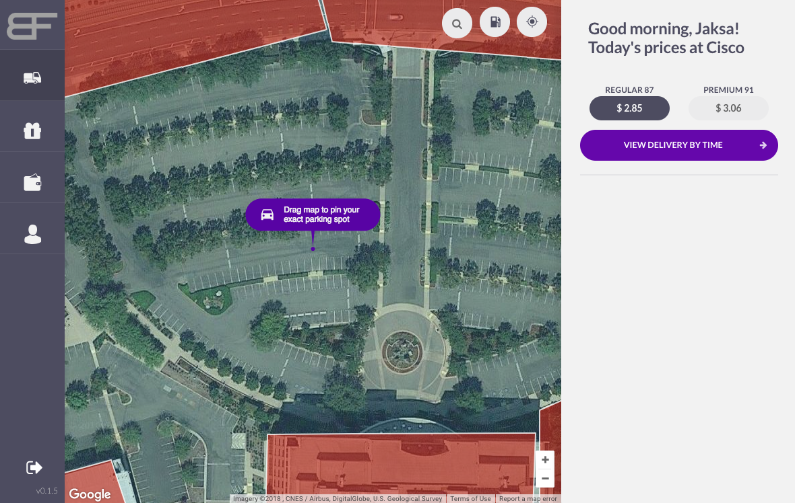

# ✌️Hello

 

Hi, I'm Javascript Developer.

## :spider_web: Social

- Homepage: [http://jaksabasic.com](http://jaksabasic.com)
- Twitter: [https://twitter.com/jaksabasic](https://twitter.com/jaksabasic)
- Github: [https://github.com/jaksa-b](https://github.com/jaksa-b)
- LinkedIn: [https://www.linkedin.com/in/jaksabasic](https://www.linkedin.com/in/jaksabasic)

## :performing_arts: Personal skills

- good interpersonal skills 
- good organizational skills
- team player but able to work on own initiative
- flexible and adaptable
- good written and oral communication skills
- enthusiastic and highly motivated

## :detective: Interests

- React
- React Native
- GraphQL
- Node.js 
- MongoDB
- Raspberry Pi

## 🧗‍♂️Hobby

- 🥾 Hike
- 🎥 Making short movies [Nanobot](https://www.youtube.com/watch?v=DTelG-PSNZ0)
- 🏋️‍♂️ Workout
- 🥘 Cook

## :school: Education
- [Vsite](http://vsite.hr/?q=en) (College for Information Technologies) - Master degree in CS
- [Algebra](http://www.algebra.hr/) Web Development Course (Html5, Css3, Wordpress, Seo)
- [Tvz](http://tvz.hr/en/) (Polytechnic university of zagreb) - Bachelor of Engineering 

## :computer: Skills

###### :closed_book: Stack

- Javascript 
- Node.js (express, Apollo GraphQL)
- React.js  (Redux, Mobx, Apollo, Jest)
- Styled components

######  :package:  DB

- MySql
- MongoDB  - Finished: [M101JS: MongoDB for Node.js Developers](https://university.mongodb.com/course_completion/44941a645a4b47c9ac4705bd9713d203)
- Oracle Pl/Sql

###### :ship:  DevOps
- GNU/Linux(Ubuntu, Debian) `medium`
- Nginx `medium`
- Docker `basics`

###### :cloud:  Cloud
- Amazon Web Services `medium`
- Heroku `medium`
- Digital Ocean `medium`

###### :hourglass:  Real-time

- Firebase `medium`

###### :iphone: Mobile
- React Native (Ios/Android)

## :wrench: Tools

###### :octopus:  Revision control
- Git (gitHub, bitBucket, gitLab) `medium ^`

###### :bookmark_tabs:  Project Management
- Trello
- Asana
- GitFlow
- Agile Scrum Methodologies
- Full Life-Cycle Software Development

###### :computer:  Code Editor

- Visual Studio Code

###### :package:  Build Tool
- Webpack

# :office: Experience

#### Javascript Developer @[digihey](http://www.digihey.com/) 
August 2017 – (Present) Zagreb  
Building Web Applications with Angular, React, Redux

#### Javascript Developer @[Dream Implementation](https://www.dream-implementation.com/) 
September 2016 – August 2017 Zagreb  
Building Web Applications with Angular

#### Full Stack Javascript Developer (meteor) @[byLapis](https://bylapis.com)  
February 2016 – August 2016 Zagreb  
Building Web Applications with React and Meteor.js

#### Javascript Developer @Cinexio  
September 2015 – January 2016 Zagreb  
Developing Javascript parsers

#### Front-end, UI Developer @Ingel  
September 2012 – September 2015 Zadar  
Developing User interface, frontend development

# :building_construction: Work

### :fuelpump: Booster Fuels Web Dashboard @[Digihey](http://www.digihey.com/)

- Html5, Css3, Sass
- React, Redux, React-router
- Google Maps Api, Rest Api
- Sentry, Google Analytics, Segment

##### 

### :fuelpump: Booster Fuels Landing page @[Digihey](http://www.digihey.com/)

- Html5, Css3, Sass
- React, Redux, Next.js, SSR

### :hospital: Styker Surgical Market Size Mapping tool @[Dream Implementation](https://www.dream-implementation.com/)

- Html5, Css3, Sass
- Bootstrap
- Angular 1.x

### [:tada: Sretno](https://www.sretno.eu/) @[Dream Implementation](https://www.dream-implementation.com/)

- Html5, Css3, Sass
- Canvas
- Bootstrap
- Angular 1.x

### :truck:  PTV Reseller @[Dream Implementation](https://www.dream-implementation.com/)

- Html5, Css3, Sass
- Bootstrap
- Angular 1.x

### [:hotel:  Hotel Jarun Zagreb](https://www.hotel-jarun.com/) @[byLapis](https://www.bylapis.com/) 

- Html5, Css3, Sass, Semantic UI
- React.js, Meteor.js, i18n
- Reservation System
- Mail Template
- SEO

### [:briefcase: ByLapis](https://bylapis.com) @ [byLapis](https://bylapis.com/) 

- Html5, Css3, Sass, Semantic UI
- Jade, Express.js, i18n
- SEO

# :video_game: Sandbox 

### [:house: Home Automation](https://github.com/jaksa-b/SmartHouse)

- Raspberry Pi
- Raspbian (Debian for Rpi)
- Web Controller UI
- Express.js
- Socket.io

### [:construction_worker_man: Field Worker](https://fieldworker0.firebaseapp.com) - [(code)](https://github.com/jaksa-b/FieldWorker)

- Html5, Css3, Sass, Bootstrap
- Angularjs
- Firebase, Google Maps Api
- Bower, Grunt

### [:bird: Twitter App](https://github.com/jaksa-b/twitter) - [(live)](https://twitter-app-demo.herokuapp.com/)

- Agularjs 
- Nodejs 
- Socket.io 
- Mongodb
- Twitter api

### :control_knobs: [Home Automation Mobile](https://github.com/jaksa-b/RpiRemote)

- Remote Raspberry Pi Controller ([Android](https://github.com/jaksa-b/RpiRemote))

### [:iphone: React Native IOS App](https://github.com/jaksa-b/githubProfiler)

- React Native
- Ecmascript 6
- Github api

