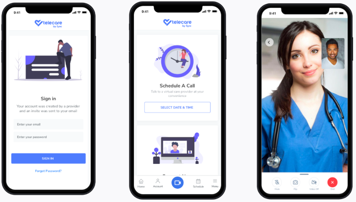

# ✌️Hello

Hi, I'm Javascript Developer.

## 🕸️ Social

- Homepage: [http://jaksabasic.com](http://jaksabasic.com)
- Twitter: [https://twitter.com/jaksabasic](https://twitter.com/jaksabasic)
- Github: [https://github.com/jaksa-b](https://github.com/jaksa-b)
- LinkedIn: [https://www.linkedin.com/in/jaksabasic](https://www.linkedin.com/in/jaksabasic)

## 🎭 Personal skills

- good interpersonal skills
- good organizational skills
- team player but able to work on own initiative
- flexible and adaptable
- good written and oral communication skills
- enthusiastic and highly motivated

## 🕵️‍♂️ Interests

- TypeScript
- React
- React Native
- Next.js
- GraphQL
- Node.js
- Raspberry Pi

## 🧗‍♂️Hobby

- 🥾 Hike
- 🏋️‍♂️ Workout
- 🥘 Cook

## 🏫 Education

- [Vsite](http://vsite.hr/?q=en) (College for Information Technologies) - Master degree in CS
- [Algebra](http://www.algebra.hr/) Web Development Course (Html5, Css3, Wordpress, Seo)
- [Tvz](http://tvz.hr/en/) (Polytechnic university of zagreb) - Bachelor of Engineering

## 💻 Skills

###### 🧱 Stack

- Javascript
- TypeScript
- React, React Native (Redux, Apollo, Jest)
- Node.js (express, Apollo GraphQL)
- Styled components

###### 📦 DB

- Sql
- MongoDB - Finished: [M101JS: MongoDB for Node.js Developers](https://university.mongodb.com/course_completion/44941a645a4b47c9ac4705bd9713d203)
- Oracle Pl/Sql

###### ⌛ Real-time

- Firebase

###### 📱 Mobile

- React Native (Ios/Android)

## 🛠️ Tools

###### 🐙 Revision control

- Git (gitHub, bitBucket, gitLab)

###### 📑 Project Management

- Trello
- Asana
- JIRA
- GitFlow
- Agile Scrum Methodologies
- Full Life-Cycle Software Development

###### 💻 Code Editor

- Visual Studio Code

###### 📦 Build Tool

- Webpack

# 🏢 Experience

#### Javascript Developer @[verybigthings](https://verybigthings.com/)

January 2019 – (Present) Remote  
Building Web & Mobile Apps with React & React Native

#### Javascript Developer @[digihey](http://www.digihey.com/)

August 2017 – September 2018 Zagreb  
Building Web Applications with Angular, React, Redux

#### Javascript Developer @[Dream Implementation](https://www.dream-implementation.com/)

September 2016 – August 2017 Zagreb  
Building Web Applications with Angular

#### Full Stack Javascript Developer (meteor) @[byLapis](https://bylapis.com)

February 2016 – August 2016 Zagreb  
Building Web Applications with React and Meteor.js

#### Javascript Developer @Cinexio

September 2015 – January 2016 Zagreb  
Developing Javascript parsers

#### Front-end, UI Developer @Ingel

September 2012 – September 2015 Zadar  
Developing User interface, frontend development

# 🏗️ Work

### Wellie @[Verybigthings](http://verybigthings.com/)

- React Native, GraphQL

##### 

### TeleCare @[Verybigthings](http://verybigthings.com/)

- React Native, GraphQL

##### 

### TeleLife @[Verybigthings](http://verybigthings.com/)

- React Native, GraphQL

##### 

### ⛽ Booster Fuels Web Dashboard @[Digihey](http://www.digihey.com/)

- Html5, Css3, Sass
- React, Redux, React-router
- Google Maps Api, Rest Api
- Sentry, Google Analytics, Segment

##### 

### ⛽ Booster Fuels Landing page @[Digihey](http://www.digihey.com/)

- Html5, Css3, Sass
- React, Redux, Next.js, SSR

### 🏥 Styker Surgical Market Size Mapping tool @[Dream Implementation](https://www.dream-implementation.com/)

- Html5, Css3, Sass
- Bootstrap
- Angular 1.x

### [🎉 Sretno](https://www.sretno.eu/) @[Dream Implementation](https://www.dream-implementation.com/)

- Html5, Css3, Sass
- Canvas
- Bootstrap
- Angular 1.x

### 🚚 PTV Reseller @[Dream Implementation](https://www.dream-implementation.com/)

- Html5, Css3, Sass
- Bootstrap
- Angular 1.x

### [🏨 Hotel Jarun Zagreb](https://www.hotel-jarun.com/) @[byLapis](https://www.bylapis.com/)

- Html5, Css3, Sass, Semantic UI
- React.js, Meteor.js, i18n
- Reservation System
- Mail Template
- SEO

### [💼 ByLapis](https://bylapis.com) @ [byLapis](https://bylapis.com/)

- Html5, Css3, Sass, Semantic UI
- Jade, Express.js, i18n
- SEO

# 🎮 Sandbox

### [🏠 Home Automation](https://github.com/jaksa-b/SmartHouse)

- Raspberry Pi
- Raspbian (Debian for Rpi)
- Web Controller UI
- Express.js
- Socket.io

### [👷‍♂️ Field Worker](https://fieldworker0.firebaseapp.com) - [(code)](https://github.com/jaksa-b/FieldWorker)

- Html5, Css3, Sass, Bootstrap
- Angularjs
- Firebase, Google Maps Api
- Bower, Grunt

### [🐦 Twitter App](https://github.com/jaksa-b/twitter) - [(live)](https://twitter-app-demo.herokuapp.com/)

- Agularjs
- Nodejs
- Socket.io
- Mongodb
- Twitter api

### 🎛️ [Home Automation Mobile](https://github.com/jaksa-b/RpiRemote)

- Remote Raspberry Pi Controller ([Android](https://github.com/jaksa-b/RpiRemote))
